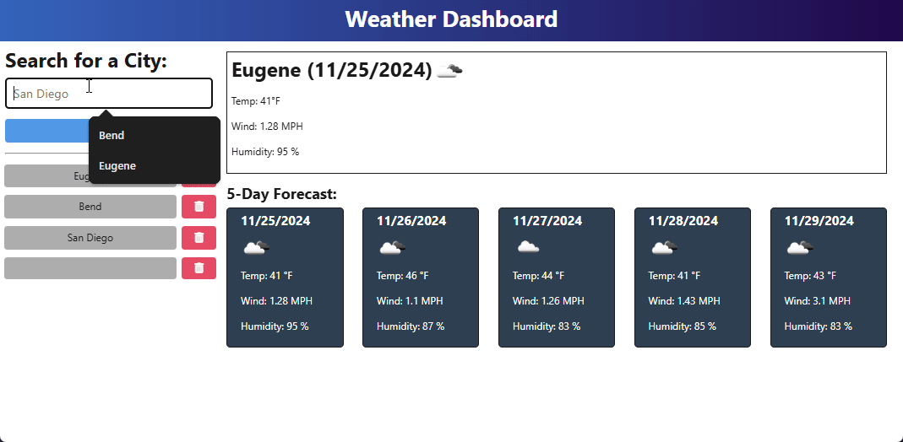

# Weather Search Application

## Description
A simple weather search application that allows users to search for weather information by city name. The application fetches weather data from the OpenWeatherMap API and maintains a search history.

## Table of Contents
- [Installation](#installation)
- [Usage](#usage)
- [Contribution](#contribution)
- [Questions](#questions)
- [Demonstration](#demonstration)
- [License](#license)

## Installation
There is no set up needed, just visit the deployment site at [Render Link](https://weather-app-32yy.onrender.com).

## Usage
Just enter the city name you are searching for and press the "Search" button.

It will save the most recent searches and includes a delete function to clear cities no longer wanted.

## Contribution
Contributions are welcome, If you have contributions you would like to make please follow these guidlines.

1. **Fork the Repository**: Click "Fork" on the top right corner of the repository page on GitHub.

2. **Make Your Changes**: Implement your changes and commit them with a clear message:
   ```bash
   git checkout -b feature/YourFeature

3. **Make Your Changes**: Implement your changes and commit them with a clear message:
   ```bash
   git commit -m "Add your feature description"

4. **Push to Your Fork**: Push your changes to your forked repository:
   ```bash
   git push origin feature/YourFeature

5. **Submit a Pull Request**: Navigate to the original repository and submit a pull request with a description of your changes.

## Questions
If you have any questions, please reach out to me at:
- Email: [skylarkline16@gmail.com](mailto:skylarkline16@gmail.com)
- GitHub: [skylark-shae](https://github.com/skylark-shae)

## Demonstration
<div style="margin-left: 40px;">
  Demonstration of the application's mobile interface:<br/>
  
</div>
<br/>


## License


This project is licensed under the MIT license.

The MIT License is a permissive software license originating at the Massachusetts Institute of Technology (MIT)[6] in the late 1980s.[7] As a permissive license, it puts very few restrictions on reuse and therefore has high license compatibility.

For more information visit [MIT Licensing](https://choosealicense.com/licenses/mit/).

- - -
© 2024 Sky-Shae Design. All Rights Reserved.
